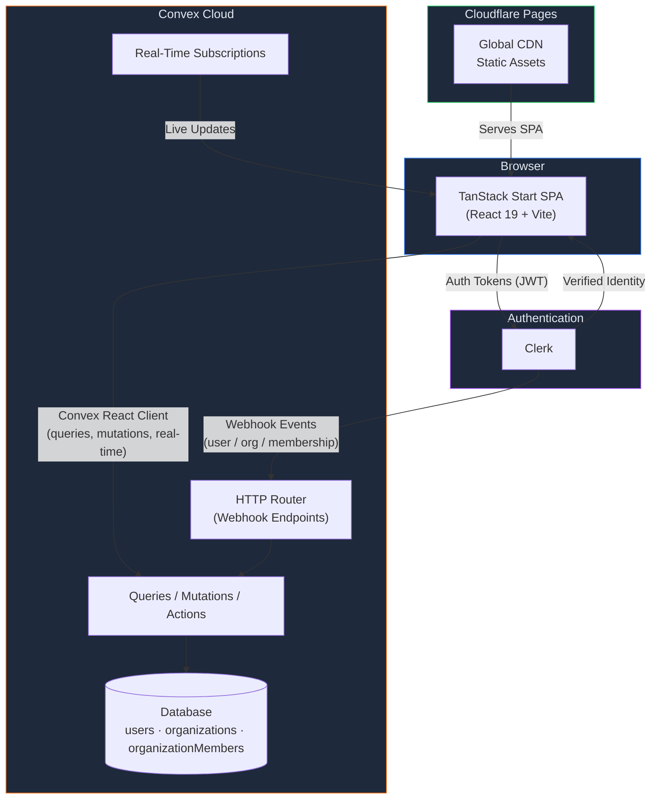
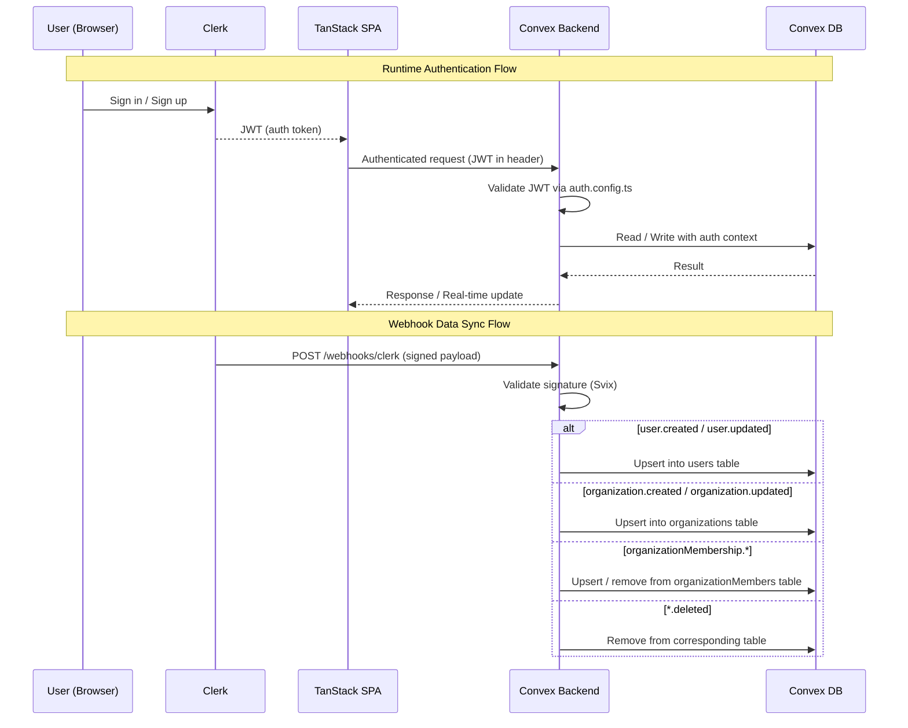
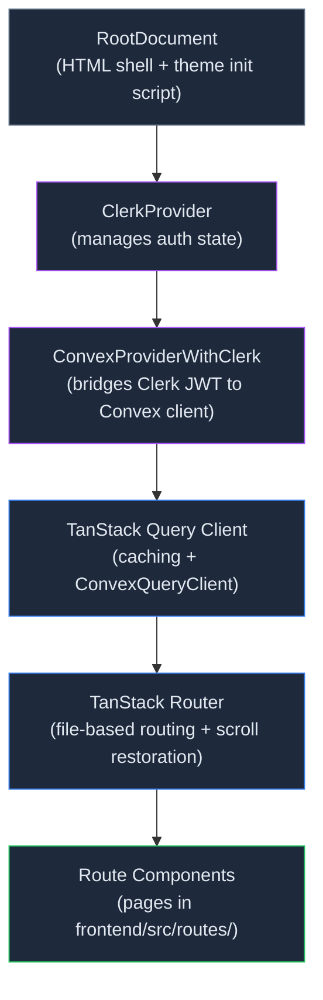
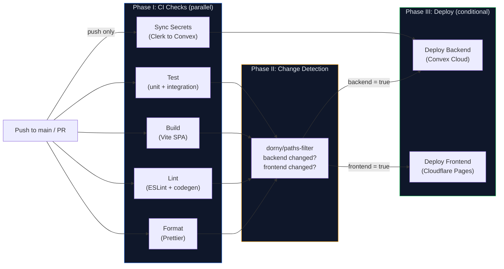

# cvault

Centralized Claude Code credential vault and sync system for managing
multiple Anthropic Claude Code subscriptions across multiple machines for
a single user.

cvault wraps [`claude-swap`](https://github.com/realiti4/claude-swap)
(local multi-account switcher backed by the Mac Keychain) with:

- **Cross-machine sync** — Convex is the source of truth; machines
  pull-on-use rather than syncing the Keychain manually.
- **Server-side OAuth refresh** — a Convex cron rotates expiring access
  tokens so re-auth happens automatically before tokens die.
- **Centralized usage view** — Anthropic's `/api/oauth/usage` endpoint is
  polled per sub and aggregated in the dashboard.
- **Audit trail** — every switch, add, pull, refresh, and remove is
  logged with the originating Clerk session id (raw IPs are SHA-256
  hashed to an 8-char prefix; raw IPs are never persisted).

The full design lives in
[`docs/superpowers/specs/2026-05-02-cvault-design.md`](docs/superpowers/specs/2026-05-02-cvault-design.md).
Implementation status and per-agent handoffs are tracked in
[`IMPLEMENTATION_NOTES.md`](IMPLEMENTATION_NOTES.md).

## Repo layout

```
cvault/
├── convex/                  # Convex backend (queries, mutations, actions, crons, http)
├── frontend/                # TanStack Start (React 19) dashboard
│   └── src/routes/dashboard # Sub list, audit feed, machines list, settings
├── cli/                     # TypeScript-on-Bun CLI (`cvault add`, `switch`, `list`, ...)
└── docs/
    ├── superpowers/specs    # Approved design spec
    └── research             # Reverse-engineering briefs (Anthropic OAuth, Clerk flow, ...)
```

## Stack

| Layer | Tech |
|---|---|
| Frontend | React 19 + TanStack Start (SPA) + TanStack Router |
| Styling | Tailwind v4 + shadcn/ui (New York, Zinc) |
| Backend | Convex (DB, functions, real-time, cron, HTTP actions) |
| Auth | Clerk (JWT to Convex; CLI uses Clerk session token) |
| CLI | TypeScript on Bun, packaged as a single static binary |
| Tests | Vitest + convex-test + Testing Library |
| Pkg mgr | Yarn 4 |

## Development

```bash
yarn install
npx convex dev          # configure / start dev backend
yarn dev                # start frontend (Vite)
yarn test               # run all backend + frontend tests
cd cli && yarn test     # run CLI tests under Bun
```

## Required env vars

On the Convex deployment (set via `npx convex env set`):

| Var | Purpose |
|---|---|
| `VAULT_AES_KEY` | 32-byte base64 master key for AES-256-GCM credential envelope |
| `CLERK_FRONTEND_API_URL` | `https://<your>.clerk.accounts.dev` |
| `CLERK_SECRET_KEY` | Clerk Backend API secret (sign-in tokens, session revoke) |
| `CLERK_WEBHOOK_SECRET` | Svix webhook secret for user sync |

Locally in `.env.local`:

| Var | Purpose |
|---|---|
| `CONVEX_DEPLOYMENT` | Auto-set by `npx convex dev` |
| `VITE_CONVEX_URL` | Auto-set by `npx convex dev` |
| `VITE_CONVEX_SITE_URL` | Auto-set by `npx convex dev` |
| `VITE_CLERK_PUBLISHABLE_KEY` | Clerk publishable key (browser-safe) |

---

## Table of Contents

- [Tech Stack](#tech-stack)
- [Architecture Overview](#architecture-overview)
- [Project Structure](#project-structure)
- [Prerequisites](#prerequisites)
- [Getting Started](#getting-started)
- [Environment Variables](#environment-variables)
- [Development](#development)
- [Scripts Reference](#scripts-reference)
- [Code Quality](#code-quality)
- [Testing](#testing)
- [Authentication (Clerk)](#authentication-clerk)
- [UI Components (shadcn/ui)](#ui-components-shadcnui)
- [Theming](#theming)
- [Type-Safe Environment (T3Env)](#type-safe-environment-t3env)
- [Path Aliases](#path-aliases)
- [Routing](#routing)
- [Convex Backend](#convex-backend)
- [Deployment](#deployment)
- [CI/CD Pipeline](#cicd-pipeline)
- [Git Hooks](#git-hooks)
- [Multi-Workbench Mode](#multi-workbench-mode)
- [Contributing](#contributing)
- [License](#license)

---

## Architecture Overview

### High-Level Architecture



### Authentication & Webhook Data Sync



### Frontend Provider Stack



### CI/CD Pipeline



---

## Tech Stack

| Layer            | Technology                                                                                       |
| ---------------- | ------------------------------------------------------------------------------------------------ |
| **Framework**    | [TanStack Start](https://tanstack.com/start) (SPA mode) with [React 19](https://react.dev)       |
| **Routing**      | [TanStack Router](https://tanstack.com/router) — file-based routing                              |
| **Data**         | [TanStack Query](https://tanstack.com/query) + [Convex React Query](https://docs.convex.dev)     |
| **Backend**      | [Convex](https://convex.dev) — serverless backend (database, functions, real-time subscriptions) |
| **Auth**         | [Clerk](https://clerk.com) — authentication, user management, organizations                      |
| **Styling**      | [Tailwind CSS v4](https://tailwindcss.com) via `@tailwindcss/vite`                               |
| **Components**   | [shadcn/ui](https://ui.shadcn.com) (New York style) + [Radix UI](https://radix-ui.com)           |
| **Icons**        | [Lucide React](https://lucide.dev)                                                               |
| **Forms**        | [TanStack Form](https://tanstack.com/form) + [React Hook Form](https://react-hook-form.com)      |
| **Validation**   | [Zod v4](https://zod.dev)                                                                        |
| **Build**        | [Vite 7](https://vite.dev) + [React Compiler](https://react.dev/learn/react-compiler)            |
| **Testing**      | [Vitest](https://vitest.dev) + [Testing Library](https://testing-library.com) + `convex-test`    |
| **Linting**      | [ESLint 9](https://eslint.org) with TanStack + Convex configs                                    |
| **Formatting**   | [Prettier](https://prettier.io) with Tailwind CSS + import sorting plugins                       |
| **Git Hooks**    | [Husky](https://typicode.github.io/husky)                                                        |
| **Runtime**      | [Volta](https://volta.sh) — Node 22.21.1 + Yarn 4.12.0                                           |
| **CI/CD**        | GitHub Actions                                                                                   |
| **Frontend CDN** | [Cloudflare Pages](https://pages.cloudflare.com)                                                 |

---

## Project Structure

```
blueprint-2.0/
├── .github/
│   ├── workflows/
│   │   └── deploy.yml                  # CI/CD pipeline
│   └── PULL_REQUEST_TEMPLATE.md        # PR checklist
├── .husky/
│   └── pre-commit                      # Pre-commit hook (lint, format, build, test)
├── convex/
│   ├── __tests__/                      # Convex function tests
│   ├── _generated/                     # Auto-generated Convex types (gitignored)
│   ├── organizationMembers/            # Org membership schema & webhook sync actions
│   ├── organizations/                  # Organization schema & webhook sync actions
│   ├── users/                          # User schema & webhook sync actions
│   ├── utils/                          # Auth helpers & request validation
│   ├── webhooks/
│   │   └── clerk.ts                    # Clerk webhook event handler
│   ├── auth.config.ts                  # Clerk auth provider config for Convex
│   ├── http.ts                         # HTTP router (webhook endpoints)
│   ├── schema.ts                       # Database schema
│   └── tsconfig.json                   # Convex-specific TypeScript config
├── frontend/
│   ├── public/
│   │   ├── _redirects                  # SPA fallback routing (Cloudflare Pages)
│   │   ├── favicon.ico                 # Favicon
│   │   ├── logo192.png                 # PWA icon (192px)
│   │   ├── logo512.png                 # PWA icon (512px)
│   │   ├── manifest.json              # PWA web app manifest
│   │   └── robots.txt                  # SEO robots file
│   ├── src/
│   │   ├── components/                 # React components
│   │   │   ├── ui/                     # shadcn/ui components
│   │   │   └── ThemeToggle.tsx         # Dark / light / auto theme switcher
│   │   ├── hooks/                      # Custom React hooks
│   │   ├── lib/
│   │   │   ├── env.ts                  # T3Env type-safe environment config
│   │   │   └── utils.ts                # Utility functions (cn helper)
│   │   ├── providers/                  # React context providers
│   │   ├── routes/                     # File-based routes (TanStack Router)
│   │   ├── schemas/                    # Zod validation schemas
│   │   ├── styles.css                  # Global styles + Tailwind CSS
│   │   ├── router.tsx                  # Router + Convex + React Query setup
│   │   └── routeTree.gen.ts            # Auto-generated route tree
│   └── vite.config.ts                  # Vite configuration (SPA mode)
├── scripts/
│   ├── dev.sh                          # Multi-workbench dev server launcher
│   ├── exportConfig.ts                 # Export Convex env vars & settings
│   ├── importConfig.ts                 # Import Convex env vars & settings
│   └── setupCloudflareProject.ts       # Create Cloudflare Pages project
├── .env.example                        # Example environment variables
├── .prettierignore                     # Prettier ignore patterns
├── .prettierrc                         # Prettier configuration
├── components.json                     # shadcn/ui configuration
├── eslint.config.ts                    # ESLint configuration
├── package.json                        # Root package manifest
├── tsconfig.json                       # Base TypeScript config
├── tsconfig.app.json                   # Frontend TypeScript config
├── tsconfig.node.json                  # Node/scripts TypeScript config
├── vitest.config.ts                    # Unit test config
├── vitest.integration.config.ts        # Integration test config
├── vitest.scenario.config.ts           # Scenario test config
└── yarn.lock                           # Dependency lock file
```

---

## Prerequisites

1. **[Volta](https://volta.sh)** — Automatically manages Node.js and Yarn versions.

   ```bash
   # macOS / Linux
   curl https://get.volta.sh | bash
   ```

   Volta will read the pinned versions from `package.json` (`node: 22.21.1`, `yarn: 4.12.0`) and install them automatically on first use.

2. **[Convex CLI](https://docs.convex.dev/getting-started)** — Required for backend development.

   ```bash
   npx convex login
   ```

3. **[Clerk](https://clerk.com) Account** — Required for authentication. Create a Clerk application and obtain your API keys.

4. **Cloudflare Account** _(for deployment only)_ — Needed to deploy the frontend to Cloudflare Pages.

---

## Getting Started

### 1. Clone the repository

```bash
git clone https://github.com/flatoutsolutions/blueprint-2.0.git
cd blueprint-2.0
```

### 2. Install dependencies

```bash
yarn install
```

> Volta will automatically use the correct Node.js and Yarn versions.

### 3. Set up environment variables

```bash
cp .env.example .env.local
```

Edit `.env.local` with your deployment values:

```env
# Convex
CONVEX_DEPLOYMENT=dev:<your-deployment-slug>
CONVEX_URL=https://<your-deployment-slug>.convex.cloud
CONVEX_SITE_URL=https://<your-deployment-slug>.convex.site

# Clerk
VITE_CLERK_PUBLISHABLE_KEY=pk_test_<your-clerk-key>
```

> You also need to set `VITE_CONVEX_URL` to the same value as `CONVEX_URL`. The `VITE_` prefix makes it available to the frontend via Vite's env injection.

### 4. Set Convex environment variables

Clerk requires several server-side environment variables on the Convex dashboard (or via `npx convex env set`):

```bash
npx convex env set CLERK_FRONTEND_API_URL "https://<your-clerk-frontend-api>"
npx convex env set CLERK_WEBHOOK_SECRET "whsec_<your-webhook-secret>"
npx convex env set CLERK_SECRET_KEY "sk_test_<your-clerk-secret-key>"
npx convex env set CLERK_PUBLISHABLE_KEY "pk_test_<your-clerk-key>"
```

### 5. Configure the Clerk webhook

In the [Clerk Dashboard](https://dashboard.clerk.com), create a webhook endpoint pointing to:

```
<CONVEX_SITE_URL>/webhooks/clerk
```

Subscribe to the following events:

- `user.created`, `user.updated`, `user.deleted`
- `organization.created`, `organization.updated`, `organization.deleted`
- `organizationMembership.created`, `organizationMembership.updated`, `organizationMembership.deleted`

### 6. Start the development server

```bash
yarn dev
```

This runs both the **Convex dev server** and the **Vite frontend** simultaneously using `concurrently`. By default, the frontend is available at **http://localhost:3000**.

---

## Environment Variables

### Local (`.env.local`)

| Variable                     | Description                              | Required |
| ---------------------------- | ---------------------------------------- | -------- |
| `CONVEX_DEPLOYMENT`          | Convex deployment identifier             | ✅       |
| `CONVEX_URL`                 | Convex HTTP URL                          | ✅       |
| `CONVEX_SITE_URL`            | Convex site URL                          | ✅       |
| `VITE_CONVEX_URL`            | Same as `CONVEX_URL` (Vite-exposed)      | ✅       |
| `VITE_CLERK_PUBLISHABLE_KEY` | Clerk publishable key (Vite-exposed)     | ✅       |
| `VITE_APP_TITLE`             | App title (shown in browser tab)         | ❌       |
| `CLOUDFLARE_API_TOKEN`       | Cloudflare API token (for setup script)  | ❌       |
| `CLOUDFLARE_ACCOUNT_ID`      | Cloudflare account ID (for setup script) | ❌       |

> `VITE_`-prefixed variables are injected into the frontend at build time by Vite. Non-prefixed variables are only available server-side / in scripts.

### Convex Dashboard Environment Variables

These are set on the Convex deployment (not in `.env.local`):

| Variable                 | Description                                      | Required |
| ------------------------ | ------------------------------------------------ | -------- |
| `CLERK_FRONTEND_API_URL` | Clerk Frontend API URL (JWT issuer domain)       | ✅       |
| `CLERK_WEBHOOK_SECRET`   | Clerk webhook signing secret (`whsec_...`)       | ✅       |
| `CLERK_SECRET_KEY`       | Clerk secret key (`sk_test_...` / `sk_live_...`) | ✅       |
| `CLERK_PUBLISHABLE_KEY`  | Clerk publishable key                            | ✅       |
| `ENVIRONMENT`            | Environment name (e.g. `production`)             | ❌       |

### CI/CD (GitHub repo secrets & variables)

| Variable                  | Type     | Description                          |
| ------------------------- | -------- | ------------------------------------ |
| `CONVEX_DEPLOY_KEY`       | Secret   | Convex deployment key                |
| `CLOUDFLARE_API_TOKEN`    | Secret   | Cloudflare API token                 |
| `CLERK_PUBLISHABLE_KEY`   | Secret   | Clerk publishable key                |
| `CLERK_WEBHOOK_SECRET`    | Secret   | Clerk webhook signing secret         |
| `CLERK_SECRET_KEY`        | Secret   | Clerk secret key                     |
| `CLOUDFLARE_ACCOUNT_ID`   | Variable | Cloudflare account ID                |
| `CLOUDFLARE_PROJECT_NAME` | Variable | Cloudflare Pages project name        |
| `ENVIRONMENT`             | Variable | Environment name (e.g. `production`) |
| `CONVEX_URL`              | Variable | Convex URL for secret syncing        |
| `VITE_APP_TITLE`          | Variable | App title (browser tab)              |

---

## Development

### Running locally

```bash
yarn dev
```

The `dev` script (`scripts/dev.sh`) launches:

1. **`npx convex dev`** — Starts the Convex development server (watches for schema & function changes, hot-syncs to cloud).
2. **`npx vite frontend`** — Starts the Vite dev server with HMR for the frontend.

Both are orchestrated by `concurrently` and share a single terminal output, color-coded:

- 🔵 **blue** — Convex
- 🟢 **green** — Frontend

### TanStack DevTools

In development mode, the app includes **TanStack DevTools** (bottom-right corner) with panels for:

- **TanStack Router** — Inspect routes, matches, and loader data.
- **TanStack Query** — Inspect queries, mutations, and cache state.

DevTools are automatically excluded from production builds.

### Building for production

```bash
yarn build
```

This command:

1. Runs `vite build` inside the `frontend/` directory (SPA mode with prerendering).
2. Copies `dist/client/_shell.html` → `dist/client/index.html` for SPA fallback routing.

> A `_redirects` file in `frontend/public/` ensures Cloudflare Pages serves `index.html` for all routes (SPA fallback).

### Previewing the production build

```bash
yarn preview
```

---

## Scripts Reference

| Script             | Command                       | Description                                  |
| ------------------ | ----------------------------- | -------------------------------------------- |
| `dev`              | `yarn dev`                    | Start Convex + Vite dev servers              |
| `build`            | `yarn build`                  | Build the frontend for production            |
| `preview`          | `yarn preview`                | Preview the production build locally         |
| `lint:check`       | `yarn lint:check`             | Run ESLint (check only)                      |
| `lint:fix`         | `yarn lint:fix`               | Run ESLint with auto-fix                     |
| `format:check`     | `yarn format:check`           | Check Prettier formatting                    |
| `format:fix`       | `yarn format:fix`             | Fix Prettier formatting                      |
| `test`             | `yarn test`                   | Run unit tests                               |
| `test:watch`       | `yarn test:watch`             | Run tests in watch mode                      |
| `test:integration` | `yarn test:integration`       | Run integration tests                        |
| `test:scenario`    | `yarn test:scenario`          | Run scenario tests                           |
| `shadcn:add`       | `yarn shadcn:add <component>` | Add a shadcn/ui component                    |
| `setup:cloudflare` | `yarn setup:cloudflare`       | Create the Cloudflare Pages project          |
| `prepare`          | `yarn prepare`                | Install Husky git hooks (runs automatically) |

---

## Code Quality

### ESLint

ESLint 9 is configured with a flat config (`eslint.config.ts`) that applies separate rule sets:

- **Root / Convex code** — `@eslint/js` recommended + `typescript-eslint` type-checked rules + Convex plugin.
- **Frontend code** — TanStack ESLint config (includes React, import rules, etc.)

```bash
yarn lint:check   # Check for lint errors
yarn lint:fix     # Auto-fix lint errors
```

### Prettier

Prettier is configured in `.prettierrc`:

- No semicolons
- Single quotes
- 120 character print width
- ES5 trailing commas
- Tailwind CSS class sorting via `prettier-plugin-tailwindcss`
- Automatic import sorting via `@trivago/prettier-plugin-sort-imports`
  - Import order: builtins → third-party → `@/` aliases → relative imports
  - Import specifiers are sorted alphabetically

Formatting is excluded from auto-generated and lock files via `.prettierignore` (`yarn.lock`, `routeTree.gen.ts`).

```bash
yarn format:check   # Check formatting
yarn format:fix     # Fix formatting
```

---

## Testing

The project uses **Vitest** with three separate configurations:

| Type            | Command                 | Config                         | Timeout | Description                               |
| --------------- | ----------------------- | ------------------------------ | ------- | ----------------------------------------- |
| **Unit**        | `yarn test`             | `vitest.config.ts`             | default | Fast unit tests (excludes scenario tests) |
| **Integration** | `yarn test:integration` | `vitest.integration.config.ts` | 30s     | Full Convex function pipeline tests       |
| **Scenario**    | `yarn test:scenario`    | `vitest.scenario.config.ts`    | 5min    | Slow tests with real API/LLM calls        |

### File naming conventions

| Pattern                 | Test type   | Example                                                     |
| ----------------------- | ----------- | ----------------------------------------------------------- |
| `*.test.ts`             | Unit        | `convex/__tests__/utils.test.ts`                            |
| `*.integration.test.ts` | Integration | `convex/__tests__/integration/pipeline.integration.test.ts` |
| `*.scenario.test.ts`    | Scenario    | `convex/__tests__/scenario/e2e.scenario.test.ts`            |

### Environment matching

- Convex function tests (`convex/**`) run in the `edge-runtime` environment (via `@edge-runtime/vm`).
- All other tests use the default environment.

### Testing stack

- [Vitest](https://vitest.dev) — Test runner
- [Testing Library (React)](https://testing-library.com/docs/react-testing-library/intro) — Component testing
- [convex-test](https://docs.convex.dev/testing) — Convex function testing with mock backend
- [@edge-runtime/vm](https://edge-runtime.vercel.app) — Edge runtime simulation for Convex tests
- [jsdom](https://github.com/jsdom/jsdom) — Browser environment simulation

---

## Authentication (Clerk)

This project uses [Clerk](https://clerk.com) for authentication, user management, and organizations, integrated with Convex as the backend.

### Architecture

```
Browser ──▶ ClerkProvider ──▶ ConvexProviderWithClerk ──▶ Convex Backend
                                                              │
Clerk Dashboard ──▶ Webhooks ──▶ POST /webhooks/clerk ──▶ Sync to DB
```

**Frontend** — The root layout (`__root.tsx`) wraps the app in `ClerkProvider` and `ConvexProviderWithClerk`, which bridges Clerk's auth tokens to Convex. This enables `ctx.auth.getUserIdentity()` in Convex functions.

**Backend** — `convex/auth.config.ts` configures Clerk as the JWT issuer. Convex validates Clerk-issued JWTs automatically.

**Webhook sync** — Clerk sends webhook events to `<CONVEX_SITE_URL>/webhooks/clerk` (defined in `convex/http.ts`). The handler (`convex/webhooks/clerk.ts`) processes these events and syncs data into Convex tables:

| Webhook Event                    | Convex Table          | Action          |
| -------------------------------- | --------------------- | --------------- |
| `user.created / updated`         | `users`               | Upsert user     |
| `user.deleted`                   | `users`               | Remove user     |
| `organization.created / updated` | `organizations`       | Upsert org      |
| `organization.deleted`           | `organizations`       | Remove org      |
| `organizationMembership.*`       | `organizationMembers` | Upsert / remove |

### Key files

| File                                    | Purpose                                            |
| --------------------------------------- | -------------------------------------------------- |
| `convex/auth.config.ts`                 | Clerk JWT issuer config for Convex                 |
| `convex/http.ts`                        | HTTP router — registers `/webhooks/clerk` endpoint |
| `convex/webhooks/clerk.ts`              | Webhook handler — dispatches to sync actions       |
| `convex/users/schema.ts`                | User table schema                                  |
| `convex/users/actions.ts`               | User upsert/remove mutations                       |
| `convex/organizations/schema.ts`        | Organization table schema                          |
| `convex/organizations/actions.ts`       | Organization upsert/remove mutations               |
| `convex/organizationMembers/schema.ts`  | Membership table schema                            |
| `convex/organizationMembers/actions.ts` | Membership upsert/remove mutations                 |
| `convex/utils/auth.ts`                  | Auth helper utilities                              |
| `convex/utils/validateRequest.ts`       | Webhook signature validation (via Svix)            |
| `frontend/src/routes/__root.tsx`        | `ClerkProvider` + `ConvexProviderWithClerk` setup  |

### Clerk setup checklist

1. Create a Clerk application at [clerk.com](https://clerk.com).
2. Copy the **Publishable Key** and **Secret Key** from the Clerk dashboard.
3. Add `VITE_CLERK_PUBLISHABLE_KEY` to `.env.local`.
4. Set Convex environment variables (see [Getting Started](#getting-started) step 4).
5. Create a webhook endpoint in Clerk pointing to `<CONVEX_SITE_URL>/webhooks/clerk`.
6. Subscribe to user, organization, and membership events (see [Getting Started](#getting-started) step 5).
7. Copy the **Webhook Signing Secret** and set it as `CLERK_WEBHOOK_SECRET` on Convex.

---

## UI Components (shadcn/ui)

This project uses [shadcn/ui](https://ui.shadcn.com) with the **New York** style and **Zinc** base color.

### Adding components

Run from the **repository root**:

```bash
yarn shadcn:add <component-name>
```

Examples:

```bash
yarn shadcn:add button
yarn shadcn:add dialog
yarn shadcn:add table
```

Components are installed to `frontend/src/components/ui/` and configured via `components.json` at the project root.

### Configuration

The `components.json` file defines:

- **Style:** `new-york`
- **CSS Variables:** enabled (Zinc palette)
- **Path aliases:** `@/components`, `@/lib`, `@/hooks`, `@/components/ui`
- **Icon library:** `lucide`

---

## Theming

The app includes a built-in **dark / light / auto** theme system.

### How it works

1. **FOUC prevention** — A blocking `<script>` in `__root.tsx` reads the saved theme from `localStorage` and applies the correct class (`dark` / `light`) to `<html>` before the page paints. This prevents a flash of unstyled content.
2. **ThemeToggle component** (`frontend/src/components/ThemeToggle.tsx`) — A button that cycles through `light → dark → auto`. The selected mode is persisted in `localStorage` under the key `theme`.
3. **Auto mode** — When set to `auto`, the theme follows the system preference (`prefers-color-scheme`) and reacts to OS-level changes in real time.

### Usage

Import and render the `ThemeToggle` component anywhere in your layout:

```tsx
import ThemeToggle from '@/components/ThemeToggle'

function MyLayout() {
  return (
    <header>
      <ThemeToggle />
    </header>
  )
}
```

CSS variables from Tailwind CSS v4 (defined in `styles.css`) automatically adapt to the active theme class.

---

## Type-Safe Environment (T3Env)

Environment variables are validated at runtime using [T3Env](https://env.t3.gg) with Zod schemas. The configuration is in `frontend/src/lib/env.ts`.

### Usage

```ts
import { env } from '@/lib/env'

// Type-safe, validated at startup
console.log(env.VITE_CONVEX_URL)
console.log(env.VITE_CLERK_PUBLISHABLE_KEY)
```

### Adding new variables

1. Add the variable to `.env.local`.
2. Define the Zod schema in `frontend/src/lib/env.ts` under the appropriate section:
   - `client` — Client-only variables (must be prefixed with `VITE_`).
   - `shared` — Available on both client and server.
   - `server` — Server-only variables.

---

## Path Aliases

The project uses the `@/*` path alias, which maps to `frontend/src/*`. This is configured in:

- `tsconfig.json` / `tsconfig.app.json` — For TypeScript resolution
- `vite.config.ts` (via `vite-tsconfig-paths`) — For Vite bundling

### Usage

```ts
// Instead of relative imports:
import { cn } from '../../../lib/utils'

// Use the alias:
import { cn } from '@/lib/utils'
```

This works for all `frontend/src/` subdirectories: `@/components`, `@/hooks`, `@/lib`, `@/providers`, `@/schemas`, etc.

---

## Routing

The app uses [TanStack Router](https://tanstack.com/router) with **file-based routing**. Route files live in `frontend/src/routes/`.

### Key files

| File                | Purpose                                                                 |
| ------------------- | ----------------------------------------------------------------------- |
| `routes/__root.tsx` | Root layout (HTML shell, head meta, devtools, Clerk + Convex providers) |
| `routes/index.tsx`  | Home page (`/`)                                                         |
| `routeTree.gen.ts`  | Auto-generated route tree (do not edit)                                 |

### Adding a new route

Create a file in `frontend/src/routes/`:

```tsx
// frontend/src/routes/about.tsx
import { createFileRoute } from '@tanstack/react-router'

export const Route = createFileRoute('/about')({
  component: AboutPage,
})

function AboutPage() {
  return <div>About</div>
}
```

TanStack Router will automatically pick up the file and add it to the route tree.

### Navigation

```tsx
import { Link } from '@tanstack/react-router'

;<Link to="/about">About</Link>
```

---

## Convex Backend

[Convex](https://convex.dev) provides the serverless backend. All backend code lives in the `convex/` directory.

### Key files

| File / Directory              | Purpose                                     |
| ----------------------------- | ------------------------------------------- |
| `convex/schema.ts`            | Database schema definition                  |
| `convex/auth.config.ts`       | Clerk authentication provider configuration |
| `convex/http.ts`              | HTTP router (webhook endpoints)             |
| `convex/users/`               | User schema & Clerk webhook sync actions    |
| `convex/organizations/`       | Organization schema & webhook sync actions  |
| `convex/organizationMembers/` | Membership schema & webhook sync actions    |
| `convex/utils/`               | Auth helpers & webhook request validation   |
| `convex/webhooks/clerk.ts`    | Clerk webhook event handler                 |
| `convex/__tests__/`           | Backend function tests                      |
| `convex/_generated/`          | Auto-generated types & API (gitignored)     |

### Config export / import

Use these scripts to migrate environment variables and database settings between Convex deployments:

```bash
# Export from current dev deployment
npx tsx scripts/exportConfig.ts

# Export from production
npx tsx scripts/exportConfig.ts --prod

# Import into current deployment
npx tsx scripts/importConfig.ts

# Import env vars only
npx tsx scripts/importConfig.ts --env-only

# Import settings only
npx tsx scripts/importConfig.ts --settings-only
```

> ⚠️ The output file `convex-config.json` contains credentials and is **gitignored**. Never commit it.

### Running Convex codegen

```bash
npx convex codegen
```

This regenerates the types in `convex/_generated/`. It is run automatically by the pre-commit hook and during CI.

---

## Deployment

This project deploys two independent services:

| Service      | Platform         | Trigger                         |
| ------------ | ---------------- | ------------------------------- |
| **Frontend** | Cloudflare Pages | Push to `main` (frontend files) |
| **Backend**  | Convex Cloud     | Push to `main` (backend files)  |

> After the one-time setup below, **all deployments are automated** via GitHub Actions on every push to `main`. You will rarely need to deploy manually.

---

### Step 1 — Set Up Convex (Backend)

1. **Create a Convex account** at [convex.dev](https://convex.dev) and create a new project.

2. **Log in** to the Convex CLI:

   ```bash
   npx convex login
   ```

3. **Link your local repo** to the Convex project (this creates `.env.local` with your deployment values):

   ```bash
   npx convex dev
   ```

   This writes your `CONVEX_DEPLOYMENT` and `CONVEX_URL` to `.env.local`.

4. **Get a deploy key** for CI/CD:
   - Go to your Convex dashboard → Project Settings → Deploy Keys
   - Create a new key and save it — you'll add this to GitHub Secrets later.

---

### Step 2 — Set Up Clerk (Authentication)

1. **Create a Clerk application** at [clerk.com](https://clerk.com).

2. **Copy your keys** from the Clerk dashboard:
   - **Publishable Key** (`pk_test_...` or `pk_live_...`)
   - **Secret Key** (`sk_test_...` or `sk_live_...`)

3. **Add the publishable key to `.env.local`**:

   ```env
   VITE_CLERK_PUBLISHABLE_KEY=pk_test_<your-key>
   ```

4. **Set server-side env vars on Convex**:

   ```bash
   npx convex env set CLERK_FRONTEND_API_URL "https://<your-clerk-frontend-api>"
   npx convex env set CLERK_WEBHOOK_SECRET "whsec_<your-webhook-secret>"
   npx convex env set CLERK_SECRET_KEY "sk_test_<your-key>"
   npx convex env set CLERK_PUBLISHABLE_KEY "pk_test_<your-key>"
   ```

   > The `CLERK_FRONTEND_API_URL` can be derived from your publishable key, or found in the Clerk dashboard under **API Keys**.

5. **Configure the Clerk webhook**:
   - In the [Clerk Dashboard → Webhooks](https://dashboard.clerk.com), create a new endpoint.
   - Set the URL to `<CONVEX_SITE_URL>/webhooks/clerk` (e.g. `https://your-slug.convex.site/webhooks/clerk`).
   - Subscribe to: `user.created`, `user.updated`, `user.deleted`, `organization.created`, `organization.updated`, `organization.deleted`, `organizationMembership.created`, `organizationMembership.updated`, `organizationMembership.deleted`.
   - Copy the **Signing Secret** and use it for `CLERK_WEBHOOK_SECRET` above.

---

### Step 3 — Set Up Cloudflare Pages (Frontend)

1. **Create a Cloudflare account** at [cloudflare.com](https://www.cloudflare.com).

2. **Create an API token**:
   - Go to [Cloudflare Dashboard → API Tokens](https://dash.cloudflare.com/profile/api-tokens)
   - Click **Create Token** → Use the **Edit Cloudflare Workers** template (or create a custom token with `Cloudflare Pages:Edit` permission)
   - Copy the token.

3. **Find your Account ID**:
   - Go to any domain in your Cloudflare dashboard, or visit the Workers & Pages overview
   - Copy the **Account ID** from the right sidebar.

4. **Add Cloudflare credentials to `.env.local`**:

   ```env
   # Cloudflare (for local setup script)
   CLOUDFLARE_API_TOKEN=your-api-token-here
   CLOUDFLARE_ACCOUNT_ID=your-account-id-here
   ```

5. **Create the Cloudflare Pages project**:

   ```bash
   yarn setup:cloudflare
   ```

   This reads your credentials from `.env.local` and creates a Pages project named `blueprint2` (default). You can customize:

   ```bash
   npx tsx scripts/setupCloudflareProject.ts --project-name my-app --production-branch main
   ```

   > If the project already exists, the script will skip creation and exit cleanly.

---

### Step 4 — Configure GitHub for CI/CD

Add the following to your GitHub repository:

**Settings → Secrets and variables → Actions → Secrets:**

| Secret                  | Value                               |
| ----------------------- | ----------------------------------- |
| `CONVEX_DEPLOY_KEY`     | Deploy key from Convex dashboard    |
| `CLOUDFLARE_API_TOKEN`  | API token from Cloudflare dashboard |
| `CLERK_PUBLISHABLE_KEY` | Clerk publishable key               |
| `CLERK_WEBHOOK_SECRET`  | Clerk webhook signing secret        |
| `CLERK_SECRET_KEY`      | Clerk secret key                    |

**Settings → Secrets and variables → Actions → Variables:**

| Variable                  | Value                                                   |
| ------------------------- | ------------------------------------------------------- |
| `CLOUDFLARE_ACCOUNT_ID`   | Your Cloudflare account ID                              |
| `CLOUDFLARE_PROJECT_NAME` | Cloudflare Pages project name (e.g. `blueprint2`)       |
| `ENVIRONMENT`             | Environment name (e.g. `production`)                    |
| `CONVEX_URL`              | Your Convex URL (e.g. `https://your-slug.convex.cloud`) |
| `VITE_APP_TITLE`          | App title for the browser tab                           |

Once configured, **every push to `main`** will automatically:

1. Run all CI checks (lint, format, build, test).
2. Sync Clerk environment variables to Convex.
3. Detect which files changed (backend vs frontend).
4. Deploy only the affected services.

---

### Manual Deployment (optional)

If you need to deploy manually outside of CI:

#### Frontend → Cloudflare Pages

```bash
# 1. Build the SPA
yarn build

# 2. Deploy to Cloudflare Pages
npx wrangler pages deploy frontend/dist/client --project-name=<your-project-name>
```

#### Backend → Convex Cloud

```bash
npx convex deploy --yes
```

> **Note:** Manual Convex deploys use the `CONVEX_DEPLOY_KEY` environment variable. Set it via `export CONVEX_DEPLOY_KEY=your-key` or pass the `--admin-key` flag.

---

## CI/CD Pipeline

The project uses a multi-phase GitHub Actions workflow (`.github/workflows/deploy.yml`):

```
Push to main / PR → Phase I → Phase II → Phase III
```

### Phase I — CI Checks (parallel)

Runs on **every push and pull request** to `main`:

| Job            | Description                                                  |
| -------------- | ------------------------------------------------------------ |
| `format`       | Checks Prettier formatting                                   |
| `lint`         | Runs ESLint (with Convex codegen)                            |
| `build`        | Builds the frontend; uploads artifact on push                |
| `test`         | Runs unit + integration tests                                |
| `sync-secrets` | Syncs Clerk env vars to Convex (push only, parallel with CI) |

### Phase II — Change Detection

Runs **only on push to `main`**, after all CI checks pass:

- Uses [`dorny/paths-filter`](https://github.com/dorny/paths-filter) to detect changed paths.
- Outputs `backend` and `frontend` flags for selective deployment.

**Backend triggers:** `convex/**`, `package.json`, `yarn.lock`, `tsconfig.json`, `tsconfig.node.json`

**Frontend triggers:** `frontend/**`, `package.json`, `yarn.lock`, `tsconfig.json`, `tsconfig.app.json`, `tsconfig.node.json`, `components.json`

### Phase III — Deploy (conditional)

| Job               | Condition              | Target           |
| ----------------- | ---------------------- | ---------------- |
| `deploy-backend`  | Backend files changed  | Convex Cloud     |
| `deploy-frontend` | Frontend files changed | Cloudflare Pages |

### Required GitHub Settings

**Secrets:**

- `CONVEX_DEPLOY_KEY` — Convex deployment key
- `CLOUDFLARE_API_TOKEN` — Cloudflare API token
- `CLERK_PUBLISHABLE_KEY` — Clerk publishable key
- `CLERK_WEBHOOK_SECRET` — Clerk webhook signing secret
- `CLERK_SECRET_KEY` — Clerk secret key

**Variables:**

- `CLOUDFLARE_ACCOUNT_ID` — Cloudflare account ID
- `CLOUDFLARE_PROJECT_NAME` — Cloudflare Pages project name
- `ENVIRONMENT` — Environment name (e.g. `production`)
- `CONVEX_URL` — Convex URL (for secret syncing)
- `VITE_APP_TITLE` — App title (browser tab)

---

## Git Hooks

[Husky](https://typicode.github.io/husky) runs the following on **every commit** via the `pre-commit` hook:

1. `yarn lint:fix` — Auto-fix lint errors
2. `yarn format:fix` — Auto-fix formatting
3. `git add -u` — Stage fixed files
4. `npx convex codegen --typecheck disable` — Regenerate Convex types
5. `yarn build` — Verify the build succeeds
6. `yarn test` — Run unit tests
7. `yarn test:integration` — Run integration tests

> This ensures that only code that passes all checks can be committed.

---

## Multi-Workbench Mode

The dev script supports multiple workbenches for parallel development. Set `WORKBENCH_NAME` in `.env.local`:

| Workbench | Port |
| --------- | ---- |
| `main`    | 3000 |
| `two`     | 3001 |
| `three`   | 3002 |

```env
# .env.local
WORKBENCH_NAME=two
```

Each workbench runs on a separate port, allowing multiple instances of the app to run simultaneously.

---

## Contributing

### Pull requests

This repository includes a **PR template** (`.github/PULL_REQUEST_TEMPLATE.md`) with a checklist covering:

- Code completeness and review
- Testing and expected behavior
- Deployment readiness and breaking changes
- Architecture and CI/CD considerations

Always link the related Jira ticket in the PR description.

### Commit workflow

The pre-commit hook (see [Git Hooks](#git-hooks)) runs lint, format, build, and tests automatically. If any check fails, the commit is rejected.

---

## License

This project is licensed under the **MIT License**. See `package.json` for details.
